Structured is a unified metrics and metadata catalog tool that helps teams manage, document, and search their data across various sources like databases and warehouses. It simplifies collaboration and improves data literacy by providing a central platform for organizing metadata, creating documentation, and ensuring data accessibility for both technical and non-technical users.

```mermaid
graph TB
    A[User] --> B[Discover 🔍]
    A --> C[Manage 📂]
    A --> D[Collaborate 🤝]

    B --> E[Data Catalog 📑]
    B --> F[Data Warehouses 💾]

    C --> G[Govern 🔐]

    D --> H[Slack 💬]

    style A fill:#93c5fd,stroke:#2563eb,stroke-width:2px
    style B fill:#93c5fd,stroke:#2563eb,stroke-width:2px
    style C fill:#93c5fd,stroke:#2563eb,stroke-width:2px
    style D fill:#93c5fd,stroke:#2563eb,stroke-width:2px
    style E fill:#93c5fd,stroke:#2563eb,stroke-width:2px
    style F fill:#93c5fd,stroke:#2563eb,stroke-width:2px
    style G fill:#93c5fd,stroke:#2563eb,stroke-width:2px
    style H fill:#93c5fd,stroke:#2563eb,stroke-width:2px
```

### 🤔 Who is this guide for?

- Data Engineers
- Data Analysts
- Data Scientists
- Revenue Ops Managers
- Business Intelligence Managers
- Founders

# Core Concepts

<CardGroup cols={2}>
  <Card title="Data Sources" icon="database" href="/intro/intro#data-sources">
    Structured connects all your data sources—BigQuery, Postgres, etc.—into one
    layer. It scans, organizes, and simplifies everything for your team.
  </Card>
  <Card
    title="Modeling and Metrics"
    icon="cube"
    href="/intro/intro#modeling-and-metrics"
  >
    Define key metrics once, and use them everywhere. Structured keeps your data
    consistent across teams, giving you one source of truth.
  </Card>
  <Card
    title="Metadata-Level Documentation"
    icon="tags"
    href="/intro/intro#metadata-level-documentation"
  >
    Structured auto-generates documentation, turning database jargon into clear
    business concepts. Now, anyone can understand the data.
  </Card>
  <Card
    title="Ask AI and Slack Integration"
    icon="robot"
    href="/intro/intro#ask-ai-and-slack-integration"
  >
    Ask AI lets you query data in plain English. With Slack integration, you can
    request data or create tickets right from your chat.
  </Card>
</CardGroup>
